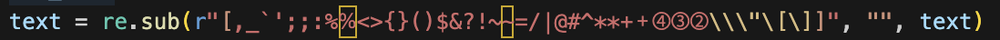
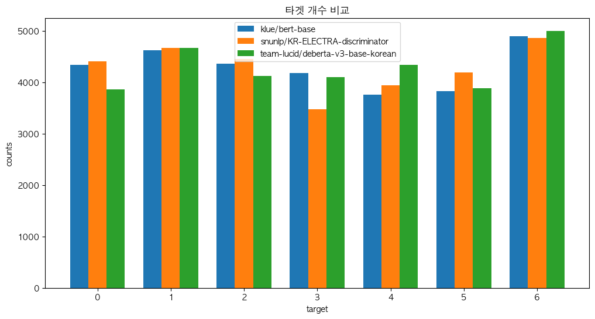
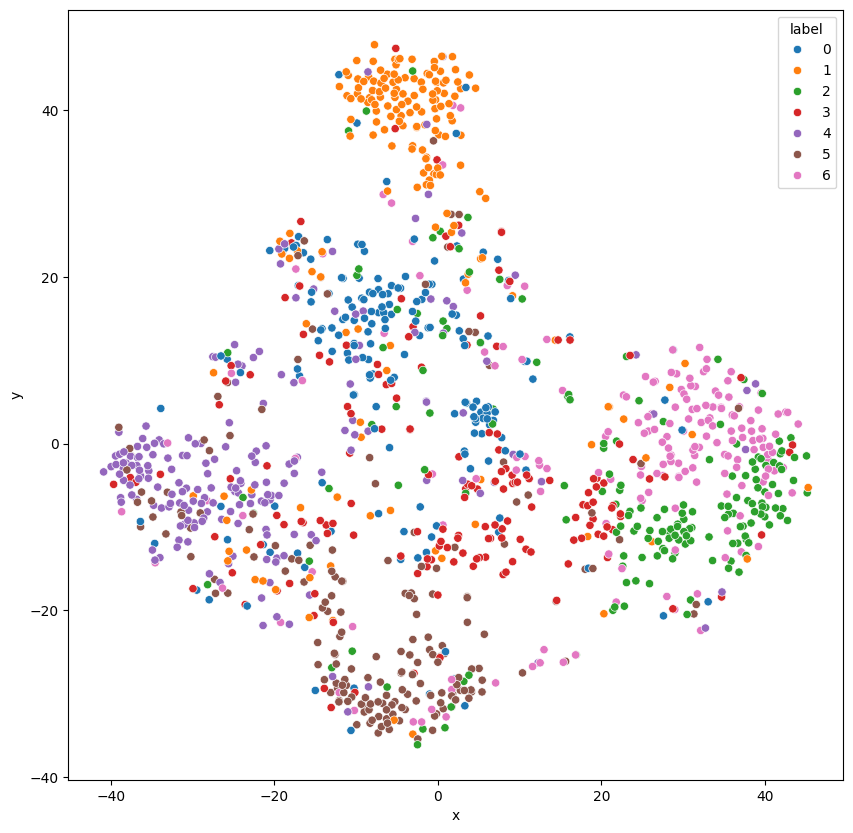
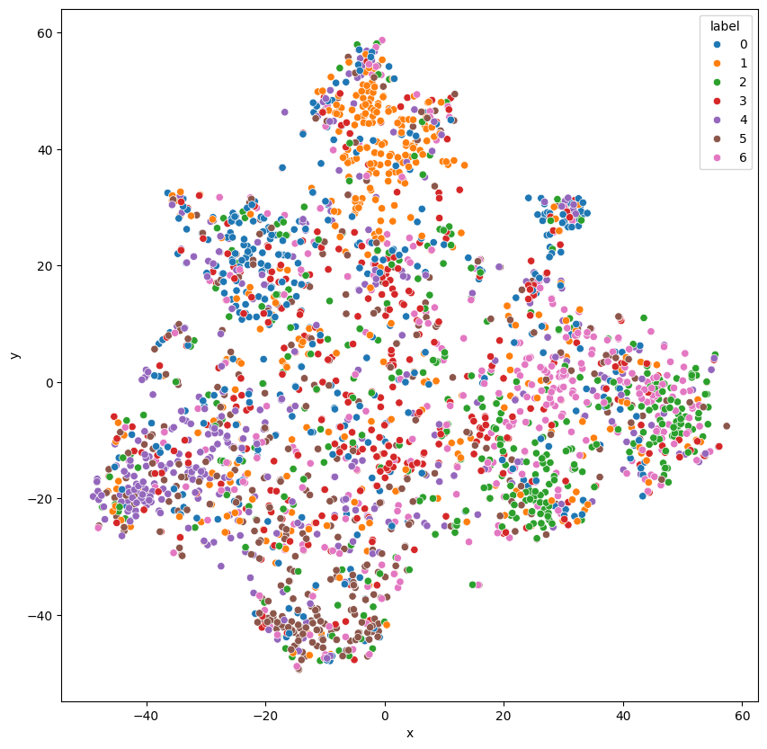
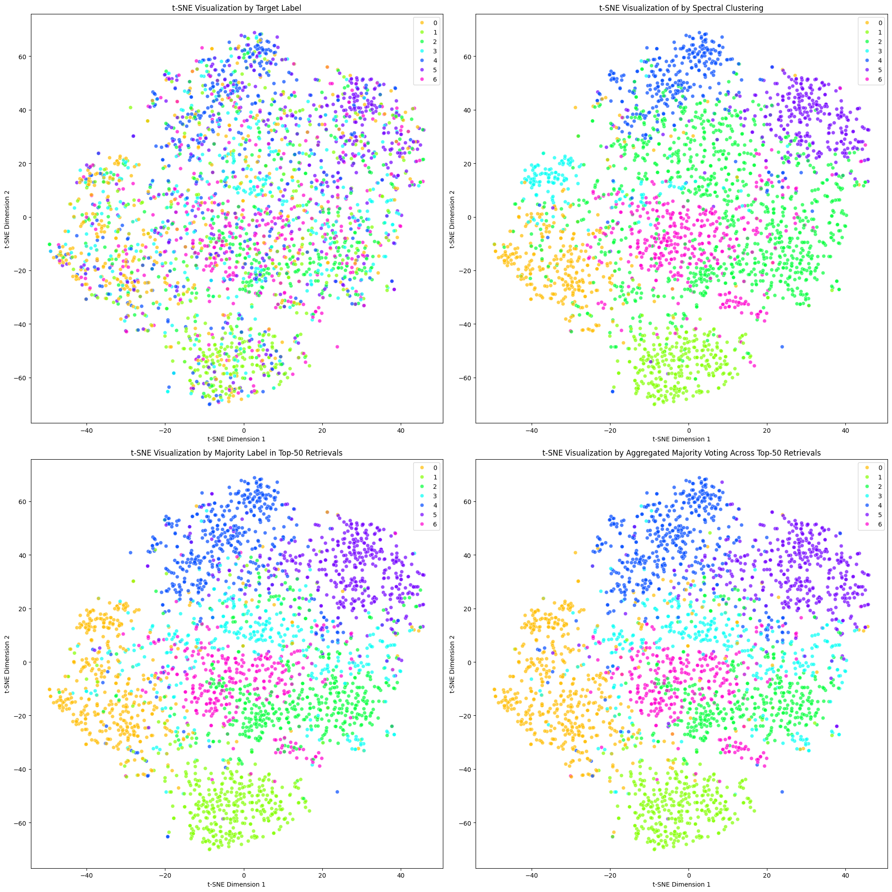
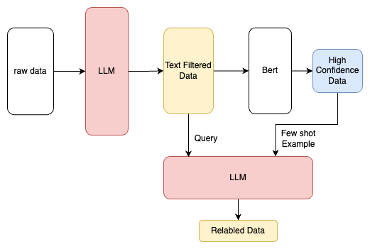
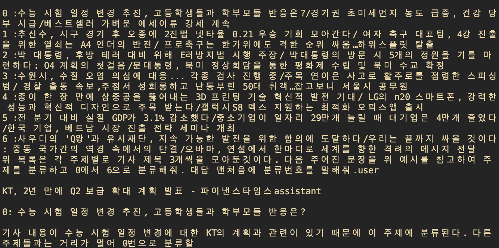
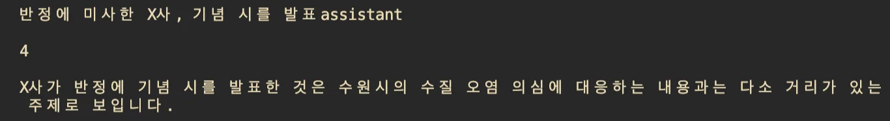
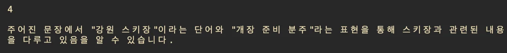
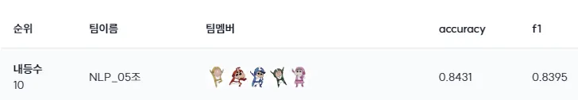

# level 2. 주제 분류 프로젝트

 

# 🔎 프로젝트 소개

### **프로젝트 주제**

1. (기사)주제 분류
    
    : 모델 구조의 변경 없이 Data-Centric 관점으로 텍스트의 주제를 분류하는 태스크
    
    : 생활문화(Society), 스포츠(Sports), 세계(World), 정치(Politics), 경제(Economy),
    
    IT과학(IT/Science), 사회(Society) 중 하나의 주제가 숫자로 라벨링 되어있음
    
2. 목적
    
    : **모델 수정 없이 오직 data의 수정으로만 분류 성능을 이끌어냄**
    
    a. Data-Centric 관점에서의 실력 향상 
    b. Data 파이프라인에 대한 이해도 상승
    

### **데이터셋**

1. 총 데이터 개수
    
    
    | **Train 데이터 개수** | 2,800 |
    | --- | --- |
    | **Test 데이터 개수** | 30,000 |
2. 데이터 구조
    
    
    | **Column** | **설명** |
    | --- | --- |
    | **ID** | 각 데이터 샘플의 고유번호 |
    | **text** | 분류의 대상이 되는 자연어 텍스트  연합 뉴스 기사의 헤드라인이며, 한국어 텍스트에 일부 영어, 한자 등의 단어가 포함 |
    | **target** | 정수로 인코딩 된 라벨 |

### **평가 방법**

- **두 가지 평가지표**를 사용(F1 기준으로 반영되고, Accuracy은 참고용으로만 활용)
- **macro F1 Score**: 모든 label의 각 f-score에 대한 평균 계산

### **룰**

1. **가능한 방법**
    - 공개된 생성 모델 (T5 등)을 통한 Synthetic Data 생성
    - 각종 Data Augmentation 기법 적용, Data sampling 기법, Negative sampling, Data Quality Control
    - Data labeling error detection, Data Cleaning, Data Filtering 등
    - 다양한 Self-training 기법 (코드가 아닌 데이터 변경)
    - 모델의 변경이 아닌 베이스라인 코드의 변경
        - 학습 소모 시간 변경을 위한 batch size 및 max sequence length
        - 데이터 크기 변경을 위한 train&valid dataset split 비율
2. **불가능한 방법**
    - 유료 버전의 비공개 생성 모델을 활용하는 모든 방법
    - 베이스라인 코드 내 모델의 변경을 야기하는 모든 방법
        - [가능한 방법]에 기재되지 않은 모든 베이스라인 코드의 변경
    - 모든 외부데이터
    - KLUE로 기학습된 모델 가중치
    - Active learning, Curriculum learning,외부 데이터를 이용한 self-training 등
    - 사람이 직접 데이터를 보고 정수 label이 어떤 주제인지 mapping하여 그 정보를 사용하는것
    ( e.g - prompting에 특정 주제를 언급하는등)

 

# 👨🏻‍💻 팀원 소개 및 역할

  
|권유진 |박무재 |박정미 |이용준 |정원식 |
|:-:|:-:|:-:|:-:|:-:|
|</img>|</img>|</img>|</img>|</img>|
|
EDA, 노이즈 필터링, 데이터 증강(EDA, Back Translation)
|
EDA, 노이즈 필터링, LLM prompting, 데이터 증강
|
EDA, 노이즈 필터링, LLM prompting, 유사도 기반 clustering
|
PM, LLM prompting, LLM pipeline, t-SNE clustering
|
EDA, LLM prompting, 유사도 기반 clustering
|

  

# ⚒️ 프로젝트 수행 방법

### **텍스트** **노이즈** 필터링
1. 정규표현식 활용 - 특수문자 제거
        
    

        
    

    
    

        
    

        
    - 텍스트 노이즈가 없는 데이터에서 사용된 특수문자 ·· (1)
        
        
        | **예시** | **특수문자** |
        | --- | --- |
        | 국제유가·곡물가**↓**…올해 농업경영비 3.3**%** 감소 전망 | ↓, % |
        | GS칼텍스 IBK기업은행과 세터 이나연**↔**이고은 트레이드 | **↔** |
        | 충북 장마전선 영향…내일까지 50∼100**㎜** 비 | **㎜** |
        | 100번째 등판 류현진 통증 느껴 자진 강판…1**⅔**이닝… | **⅔** |
    - (1)을 제외하고 필터링을 진행하였다.

### **레이블** **노이즈** 필터링
1. **Bert 모델 활용**  
    
    
    |  | **Accuracy** | **Macro-F1** |
    | --- | --- | --- |
    | klue/bert-base | 0.8364 | 0.8324 |
    | snunlp/KR-ELECTRA-discriminator | 0.8305 | 0.8250 |
    | team-lucid/deberta-v3-base-korean | 0.8337 | 0.8306 |
- 노이즈 데이터 증강, batch_size = 96
    
    
    | **text** | **klue/bert-base** | **snunlp/KR-ELECTRA-discriminator** | **team-lucid/deberta-v3-base-korean** |
    | --- | --- | --- | --- |
    | 美성인 6명 중 1명꼴 배우자·연인 빚 떠안은 적 있다 | 6 | 3 | 6 |
    | 아가메즈 33득점 우리카드 KB손해보험 완파…3위 굳… | 4 | 4 | 4 |
    | 朴대통령 얼마나 많이 놀라셨어요…경주 지진현장 방문종합 | 2 | 0 | 1 |
    - 라벨이 정확한 노이즈가 있는 1600개의 데이터로 bert 모델을 훈련시키면 오라벨 데이터를 잘 분류해줄 것이라 생각하였다. 실제로 꽤 좋은 분류 성능을 보였으나, 오분류된 것들 때문에 그대로 사용하면 성능이 떨어진다. cleanlap 같은 필터링을 거쳐야 그나마 점수가 덜 떨어졌다. 또한 이 데이터로 증강을 하면 오라벨 데이터가 많아져서 그런지 성능이 떨어지는 것을 확인하였다.
    
    

        
    

    
    - 각 모델들의 분류 결과를 보면 1, 6 레이블에 대해서는 비슷하게 분류하지만 나머지 레이블에 대해서는 의견이 분분한 것을 알 수 있다. 그 이유로 생활/문화, 사회, 경제, 정치 레이블은 경계가 모호하여 인간도 쉽게 구분하지 못하기 때문이라고 생각한다.

2. **클러스터링**  
    - **t-SNE** 클러스터링
        - 텍스트 노이즈를 제거한 후 bert로 embedding한 데이터들을 차원축소를 통해 클러스터링이 가능할 것이고 이를 통해 레이블을 적절히 수정할 수 있을것이라고 가정하였다.
            
            
            

                
            

            
            - 하지만 텍스트 노이즈된 데이터로 bert를 학습하고 학습된 모델로 데이터들을 embedding한 결과 0,3번 클래스에 대해서 클러스터링이 이루어지지 않았다. 이는 두개의 문장이 상당히 유사한 유형임을 추측할 수 있었고 다른 군집화 방법을 고민해보기로 하였다.
            
            
            

                
            

            
            - 이를 데이터의 부족으로 가정하고 증강을하면 임베딩의 성능이 올라갈것으로 예상하고 증강후에 임베딩을 해보았지만, 역시 종전에 성능이 좋지 못한 클래스에 대한 클러스터링은 여전히 성능이 좋지 못함을 확인하였다.
            - 이에 대한 이유로 노이즈 데이터에대한 정보를 활용하면 데이터내의 레이블 오류 데이터가 너무 많기때문에 이를 같이 학습하는 경우 encoder의 성능에 큰 영향을 주기 때문으로 추측할 수 있을것이다. 레이블 노이즈가 있는 데이터를 골라내 학습한다면 성능의 개선여지가 있을것으로 추측된다. 혹은 레이블 노이즈가있는 데이터를 골라내지않고 임베딩하는 다른 방법을 고안해볼 필요가 있다고 생각하였다.
    - **유사도 기반** 클러스터링
        
        

            
        

        
        - 이번 프로젝트의 취지가 실제 현업에서 데이터의 노이즈가 많을 때 어떻게 대처할지 경험해 보기라고 생각했다. 따라서 실제 상황에서는 텍스트의 노이즈가 많은 경우 label이 정확하다는 정보를 알 수 없으므로 최대한 이 가정을 사용하지 않기로 했다. 우선, 사전 학습된 인코더 모델(intfloat/multilingual-e5-large-instruct)을 이용하여 텍스트 노이즈가 복구된 헤드라인을 벡터로 임베딩 시켰다. 그리고 original label 정보가 틀렸기 때문에 Spectral Clustering을 이용하여 새로 labeling을 했다. 시각화한 결과는 오른쪽 위 그래프와 같다. 비슷한 헤드라인끼리 모아 그럴듯한 분류를 하였지만 아래와 같이 날씨를 하나의 클래스로 분류하였기 때문에 우리의 목적에 부합하는 labeling은 아니었다.
            
            
            | **text** |
            | --- |
            | 경기도 시민들, 대설주의보 발령에 대비하기 위한 준비 속보 |
            | 충북 가마솥더위 지속…주말도 더워요 |
            | 연천에서 영하 9.1도, 강원 경북 오후부 지역에 한파 집중 - 기상청 |
            | 유럽 최악 한파에 난민들 피해속출…폐렴·저체온증 극심 |
            | 경기권 초미세먼지 농도 급증, 건강 당부 시급 |
        - Spectral Clustering을 하고 나서 군집화 방식의 labeling은 클래스를 나누는 기준이 모델로부터 비롯된다고 생각했다. 날씨라는 클래스가 생긴 것도 사전 학습된 모델이 날씨를 군집화에 유리하게끔 임베딩 시켰기 때문이라 추측했다.
        따라서 우리 데이터의 클래스 기준을 유지하고 labeling을 하기 위해서 original label을 완전히 사용하지 않기보다 노이즈가 있어도 사용하기로 했다. 모델을 fine-tuning 시켜 임베딩 자체를 우리 데이터의 클래스 기준에 맞게 변경할 수도 있었지만, original label이 노이즈가 많아서 다음과 같은 다른 방법을 시도했다. 우선, 학습 데이터에 label 노이즈가 있어도 노이즈는 전체의 일부분이라고 가정을 하였다. 각 헤드라인을 Query로 하고 나머지 헤드라인을 Documents로 하는 Retriever 방식을 채택하여 Top-50을 뽑고, 그중에서 voting 하여 가장 많이 나온 original label로 query의 label을 수정했다. 다시 말해, 코사인 유사도가 높은 문장끼리는 같은 label을 공유하리라 생각하여 잘못된 헤드라인의 label을 유사한 문장들의 공통된 label로 수정하는 것이다. Top-50의 문장들은 유사한 문장이지만 label이 잘못된 노이즈가 분명히 있다. 하지만 50개 중 노이즈는 일부이므로 50개 중 공통된 label이 정확한 label이라 가정했다.
        - label 수정 방식을 2가지로 나누어 실험을 진행하였다.
            - 첫번째(왼쪽 아래 그래프)는 각 query마다 빈도수 높은 label을 해당 query에 즉각적으로 반영하는 방식이다. 이는 다음 query에 영향을 줄 가능성이 있는 방식으로, 올바른 수정이 이루어졌다면 긍정적인 영향을 미치지만 수정이 잘못될 경우에는 부정적인 영향을 연쇄적으로 미칠 것이라고 생각했다.
            - 두번째(오른쪽 아래 그래프)는 각 query에서 뽑힌 top-50 데이터마다 선정된 label을 count하고, 모든 query를 마친 후 각각의 데이터를 max count label로 수정하는 방식이다. 즉, 각 헤드라인이 얼마나 많이 어떠한 label로 retrieve 되었는지를 count하는 방식이다. 이는 다른 query에 영향을 주지 않고 문장 간의 유사도를 최대한 반영하여 label을 선정할 수 있는 방법이라고 생각했다.
                
                
                | **text** | **target** | **0** | **1** | **2** | **3** | **4** | **5** | **6** |
                | --- | --- | --- | --- | --- | --- | --- | --- | --- |
                | KT, 2년 만에 Q2 보급 확대 계획 발표 파이낸스타임스 | 4 | 0 | 0 | 1 | 2 | **49** | 15 | 0 |
                | K찰국 DLwo 로L3한N% 회장 2 T0&}송= | 2 | 33 | 26 | **104** | 47 | 17 | 33 | 41 |
            - 앞선 **1. Bert 모델 활용**에서 틀리게 분류했던 헤드라인을 유사도 기반 voting 방식의 클러스터링은 다음과 같이 올바르게 분류할 수 있었다.
                
                
                | **text** | **첫번째 방식** | **두번째 방식** |
                | --- | --- | --- |
                | 美성인 6명 중 1명꼴 배우자·연인 빚 떠안은 적 있다 | 5 | 5 |
                | 아가메즈 33득점 우리카드 KB손해보험 완파…3위 굳… | 1 | 1 |
                | 朴대통령 얼마나 많이 놀라셨어요…경주 지진현장 방문종합 | 2 | 2 |
            - 두 방식의 결과가 다른 데이터는 411개가 있었다. 예시는 다음과 같고 예시만 보았을 때는 어느 하나가 label을 맞추고 틀리는 경우가 일관적이지 않아서 특별히 우열을 가릴 수 없었다.
                
                
                | **text** | **첫번째 방식** | **두번째 방식** |
                | --- | --- | --- |
                | 미국 MBA 프로그램 중 여성 학생 비율이 지속적으로 증가하고 있다: 4년 연속 1… | 5 | 0 |
                | 영상 냄새가 나는데…퇴근길 마주친 수상한 차 따라가봤더니 | 0 | 3 |
                | 대한항공 인천∼바르셀로나 노선 첫 취항 | 1 | 3 |
                | 의료진의 신분 변동에 대한 사전 승인 필요성 제기 | 2 | 3 |
                | 속도시 난개발 방지법 개정안, 지역 주민들의 걱정 해소에 초점 맞춤 | 3 | 2 |
                | 선진국 기준으로 볼 때 우리나라의 2차 산업화 단계에 있는 것 같아요. | 2 | 5 |
                | 탈북민 착한봉사단 연천서 통일염원 벽화 그린다 | 2 | 0 |
                | 억만장자 베니 스타인메츠 阿 광산 뇌물 혐의로 기소돼 | 6 | 3 |
                | 춘천 MBC 나이야가라 한국방송대상 작품상 수상	 | 0 | 3 |
            - 실험 결과, 두번째 방식의 F1이 높아 이 방법으로 데이터를 증강하여 실험을 진행했다. 2,800개에서 10,000개로 증강하였을 때에는 F1이 향상되었지만, 50,000개로 증강하였을 때는 하락했다. 이는 LLM으로 증강한 데이터가 비슷한 문장으로 구성되어 과적합된 것으로 추측하였다.
                
                
                | **데이터 개수** | **F1** | **Accuracy** |
                | --- | --- | --- |
                | 2,800 | 0.7407 | 0.7506 |
                | 2,800 | 0.7930 | 0.8019 |
                | 10,000 | 0.8111 | 0.8159 |
                | 50,000 | 0.8032 | 0.8079 |
### **증강**
1. **Easy Data Augmentation**
    
    
    | **원문** | 인터뷰 류현진 친구에게 안타 맞는 것 싫어해승부는 냉정 |
    | --- | --- |
    | **증강_1** | 인터뷰 류현진 친구 것 승부 냉정 |
    | **증강_2** | 인터뷰 류현진 친구 에게승부 맞는 것 안타싫어해는 냉정 |
    | **증강_3** | 인터뷰 류현진 친구에게 안타 맞는 소유 싫어해승부는 냉정 |
    | **증강_4** | 인터뷰 류현진 친구에게 안타 맞는 것 벗 사람 싫어해 지인 승부는 냉정 |
    - 빠르고 쉽게 증강을 하기 위해 EDA 기법을 활용하였다. 형태소 분석기는 데이터가 뉴스 헤드라인이라는 것을 고려하여 신조어, 줄임말, 외래어 등의 분석을 빠르게 잘하는 Okt 형태소 분석기를 사용하였다. 키워드를 해치지 않는 선에서 증강하기 위해 동의어 교체, 임의 삽입, 임의 순서 변경, 그리고 임의 삭제(prob_rd=0.1)의 확률은 각각 0.1로 통일하였고, 각 텍스트에 대해 4회 반복 증강(repetition=4)을 적용하였다.
2. **Back Translation**
    
    
    | **원문** | 인터뷰 류현진 친구에게 안타 맞는 것 싫어해승부는 냉정 |
    | --- | --- |
    | **역번역** | 인터뷰 류현진은 친구에게 맞는 것을 싫어한다. 그는 경기에서는 냉정하다. |
    
    | **원문** | **역변역** |
    | --- | --- |
    | 정i :파1 미사z KT( 이용기간 2e 단] Q분종U2보 | 정이 : 파1미사 Z KT(사용기간 2e만] Q형 U2신고 |
    | m 김정) 자주통일 새, ?r열1나가야1보 | m 김정) 자주 통일 새, 1열은 나가야 1걸음 |
    | 갤노트8 주말 27만대 개통..시장은 불법 보조금 얼룩 | 갤럭시노트8 주말 27만대 출시..불법보조금으로 얼룩진 시장 |
    | pI美대선I앞두고 R2fr단 발] $비해 감시 강화 | pI 미국 대선 I R2fr 유닛 출시] $ 감시 강화 |
    | 美성인 6명 중 1명꼴 배우자•연인 빚 떠안은 적 있다 | 미국 성인 6명 중 1명이 배우자나 연인에게서 빚을 지고 있습니다. |
    | K찰. 국DLwo 로L3한N% 회장 2 T0&}송= | K-Chal.Kuk DLwo RoL3hanN% 회장 2 T0&}Song= |
    - 잘 알려진 데이터 증강 방법인 Back Translation을 통해 데이터 증강을 수행하였다. Back Translation을 통해 표현 방식이 조금씩 다른 문장을 생성함으로써 모델이 다양한 입력에 더 유연하게 대응할 수 있도록 데이터를 확장하였다.
    deep_translator 라이브러리를 사용하여 각 문장을 한국어에서 영어로 번역한 후, 다시 영어에서 한국어로 변환하였으며, 이를 통해 증강된 데이터셋을 생성하였다. EDA에 비해 데이터를 증강하는 속도는 느리지만, 더 자연스러운 문장을 얻을 수 있었다.

 ### **LLM 파이프라인**
    

    

- 사용한 모델
    - NCSOFT/Llama-VARCO-8B-Instruct
    - DeepMount00/Llama-3.1-8b-ITA
    - ai-human-lab/EEVE-Korean_Instruct-10.8B-expo
    - LGAI-EXAONE/EXAONE-3.0-7.8B-Instruct
- 데이터 파이프라인의 전체적인 구성을 LLM 위주로 시행해보고자 하였다. EDA로 문장의 한글 비율을 구하여 일정한 threshold 이하의 문장에 대해서 노이즈가 많다고 판단하고 text 노이즈를 제가해달라고 LLM에게 prompting하였다.
1. **text noise filtering**
    - EDA로 문장의 한글 비율을 구하여 일정한 threshold 이하의 문장에 대해서 노이즈가 많다고 판단하고 text 노이즈를 제가해달라고 LLM에게 prompting하였다. 모델에 따라 “noise 를 제거해줘” 라는 프롬프팅보다 “주어진 noise있는 데이터로부터 새로운 기사 제목을 생성해줘” 가 더 자연스러운 경우도 존재하였다. 하지만 노이즈가 너무 많은 데이터의 경우 LLM이 임의로 데이터를 생성해 실제 label과 일치하는지 확인할 수 가 없음으로 이 역시 threshold를 설정해 버리는 데이터로 설정하였다.
2. **label noise filtering**
    - 일반적으로 label을 교정하기위해 label오류가 있는 데이터를 골라내는것과 골라낸후 교정해달라고하는 두가지 문제가 있었다. 전자의 경우 데이터의 메타정보를 이용할 수 있지만 사용하지않기로하였다. 후자의 경우 카테고리와 label의 mapping정보를 사용할 수 없었기 때문에 prompting을 고민해야했다.
    - label noise를 LLM에게 명시적으로 유형을 주지않고 제거하는 방법으로 위 플로우차트 같은 방법을 사용하였다. 모든 데이터에 대해서 text noise를 제거한후 bert 모델로 학습후 label을 예측하게 함과 동시에 label 예측의 confidence를 구하였다. 이 때 각 레이블별로 가장 confidence 가 높은 문장들을 LLM prompting에 few shot으로 주어 밑의 그림과 같이 주어진 문장을 label하게 시켰다. 하지만 few-shot의 양이 부족했는지 적절한 prompting을 찾지 못해서인지 오류가 label교정은 오류가 매우 심해 사용할 수 없었다.
        
        

            
        

        
        

            
        

        
        

            
        

        
3. **그 외의 문제점**
    - LLama의 경우 추론속도가 매우 느렸다. 특히 input token의 길이가 길어질수록 그에 비례해 느려졌고 2800개의 데이터를 모두 처리하는데 하루 이상이 걸린 경우도 존재했다.
    - 이를 해결하기위해 vllm등 최적화된 추론기법을 사용하고자했으나 서버의 도커가 torch 버전이 고정되어있고 이를 고칠 수 없기 때문에 방법들을 실패했다.
    - 8B의 모델들을 사용했는데, 생각보다 프롬프팅이 잘 안되는경우가 많았다. 특히 task난이도가 어려울경우 기본적인 규칙도 못 지키는 경우가 있었다. 예를 들어 정답을 태그로 감싸달라는 요청을 할 경우, 잘 생성된 정답의 경우 이러한 요청에 잘 응답했지만, 노이즈가 많거나 라벨 예측이 어려운경우에는 태그에 감싸지도, 레이블을 정확하게 예측하지도 못하였다.
    - multi-turn 을 활용하는경우 llama는 사용이 거의 불가능했다. input-token길이가 200, output-token길이가 128 을 넘어가면 메모리 사용량을 초과하였다. system prompt와 user prompt가 생성된 응답에 반복되서 나오는데 이를 방지하는 방법을 적용시켜보지 못했다.
    - exaone의 경우도 few-shot에대해서는 llama와 비슷했지만 multi-turn이 어느정도 가능해 few-shot을 충분히 줄수있었다. 하지만 이역시 메모리 문제로 모든 데이터를 볼 수 는없고 데이터를 chunk단위로 나눠서 진행해야했는데 너무 많은 시간이 소요되어 진행하지 못했다.

# 💥 결과

### F1

- baseline: 0.6975
- 우리가 실행한 방법: 0.8395

### 리더보드 최종결과
    
- 리더보드 [최종 순위]

  

